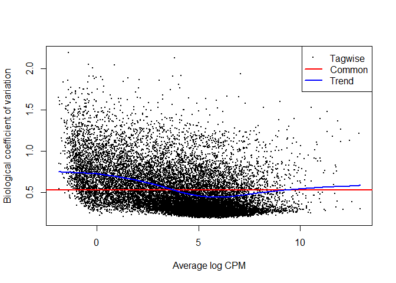
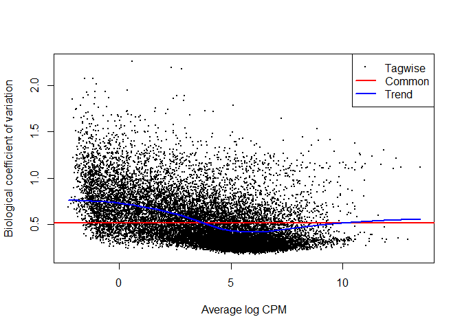
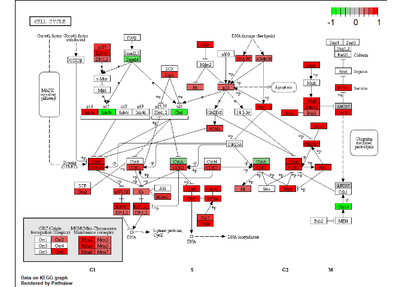
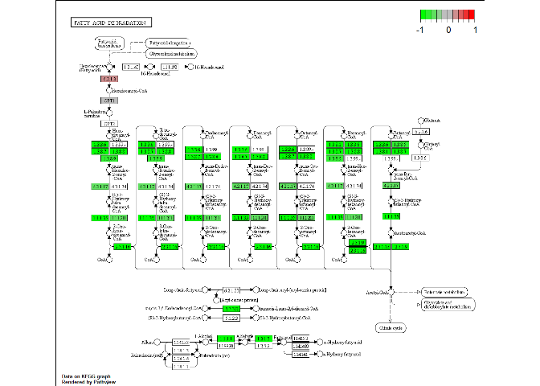
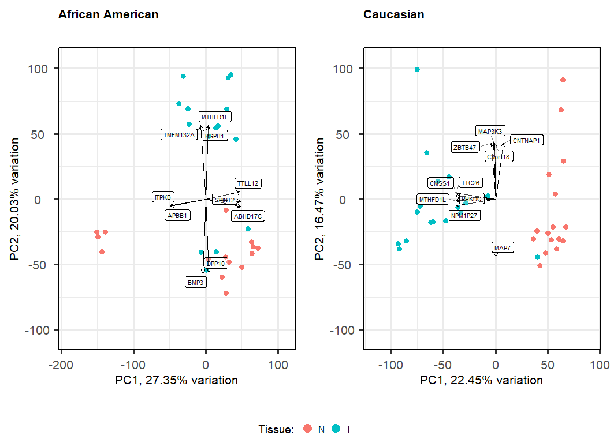

GSE146009 Analysis
================
Erik Joplin
9/9/2021

``` r
library(knitr)
library(kableExtra)
library(org.Hs.eg.db)
library(tidyverse)
library(edgeR)
library(pathview)
library(PCAtools)
library(gridExtra)
library(lemon)
```

``` r
count_data_AA <-  read_tsv('GSE146009_AfricanAmerican_RawCounts.txt')
count_data_Cau <- read_tsv('GSE146009_Caucasian_RawCounts.txt')
count_data_Cau <- count_data_Cau %>% select(-SB394T_S14) # no 'N' sample for 394 provided

gene_date_conversion <-  read_tsv('Gene_Date_conversion.csv', 
                                  col_names = c('gene', 'date'))

sample_info <-  read_csv('sample_info.csv')
sample_info <- sample_info %>% filter(sample_name != 'SB394T_S14')

samples_AA <- colnames(count_data_AA[-1]) %>% as.data.frame() %>% 
  left_join(sample_info, by =c('.'= 'sample_name'))
colnames(samples_AA) <- c('sample', 'ethnicity', 'patient', 'tissue')

samples_Cau <- colnames(count_data_Cau[-1]) %>% as.data.frame() %>% 
  left_join(sample_info, by =c('.'= 'sample_name'))
colnames(samples_Cau) <- c('sample', 'ethnicity', 'patient', 'tissue')


sample_info %>% head(5) %>% kable() %>% kable_styling()
```

<table class="table" style="margin-left: auto; margin-right: auto;">
<thead>
<tr>
<th style="text-align:left;">
sample\_name
</th>
<th style="text-align:left;">
ethnicity
</th>
<th style="text-align:right;">
patient
</th>
<th style="text-align:left;">
tissue
</th>
</tr>
</thead>
<tbody>
<tr>
<td style="text-align:left;">
DS15-T\_S15
</td>
<td style="text-align:left;">
AA
</td>
<td style="text-align:right;">
15
</td>
<td style="text-align:left;">
T
</td>
</tr>
<tr>
<td style="text-align:left;">
DS17-T\_S2
</td>
<td style="text-align:left;">
AA
</td>
<td style="text-align:right;">
17
</td>
<td style="text-align:left;">
T
</td>
</tr>
<tr>
<td style="text-align:left;">
DS5-T\_S12
</td>
<td style="text-align:left;">
AA
</td>
<td style="text-align:right;">
5
</td>
<td style="text-align:left;">
T
</td>
</tr>
<tr>
<td style="text-align:left;">
DS14-T\_S11
</td>
<td style="text-align:left;">
AA
</td>
<td style="text-align:right;">
14
</td>
<td style="text-align:left;">
T
</td>
</tr>
<tr>
<td style="text-align:left;">
DS17-N\_S1
</td>
<td style="text-align:left;">
AA
</td>
<td style="text-align:right;">
17
</td>
<td style="text-align:left;">
N
</td>
</tr>
</tbody>
</table>

GSE146009 contains raw read numbers for 15 African American (AA)
patients and 17 (Cau) Caucasian patients. The read numbers are were
gathered using using RNAseq with a paired experiment, taking a tumor
cell sample (T) and a non-tumor adjacent cell sample (N) for each
patient with no replicates. These RNAseq reads were mapped against a
reference genome to produce counts. The purpose is to investigate the
mRNA expression levels of colorectal cancer patients, specifically
comparing African American patients to Caucasian patients. It has been
observed previously that African American patients with colorectal
cancer have greatly decreased survival rates.

``` r
kable(count_data_AA[1:10,1:10]) %>% kable_styling()
```

<table class="table" style="margin-left: auto; margin-right: auto;">
<thead>
<tr>
<th style="text-align:left;">
Gene Symbol
</th>
<th style="text-align:right;">
DS15-T\_S15
</th>
<th style="text-align:right;">
DS17-T\_S2
</th>
<th style="text-align:right;">
DS5-T\_S12
</th>
<th style="text-align:right;">
DS14-T\_S11
</th>
<th style="text-align:right;">
DS17-N\_S1
</th>
<th style="text-align:right;">
DS15-N\_S8
</th>
<th style="text-align:right;">
DS2-T\_S15
</th>
<th style="text-align:right;">
DS16-T\_S10
</th>
<th style="text-align:right;">
DS4-N\_S3
</th>
</tr>
</thead>
<tbody>
<tr>
<td style="text-align:left;">
7SK
</td>
<td style="text-align:right;">
39.0000
</td>
<td style="text-align:right;">
17.0000
</td>
<td style="text-align:right;">
18.0046
</td>
<td style="text-align:right;">
7.00000
</td>
<td style="text-align:right;">
23.0000
</td>
<td style="text-align:right;">
92.00000
</td>
<td style="text-align:right;">
4.00141
</td>
<td style="text-align:right;">
7.21512
</td>
<td style="text-align:right;">
14.00630
</td>
</tr>
<tr>
<td style="text-align:left;">
A1BG
</td>
<td style="text-align:right;">
50.0000
</td>
<td style="text-align:right;">
54.0000
</td>
<td style="text-align:right;">
31.8392
</td>
<td style="text-align:right;">
20.71170
</td>
<td style="text-align:right;">
22.8949
</td>
<td style="text-align:right;">
7.01613
</td>
<td style="text-align:right;">
31.60750
</td>
<td style="text-align:right;">
24.00000
</td>
<td style="text-align:right;">
13.00330
</td>
</tr>
<tr>
<td style="text-align:left;">
A1BG-AS1
</td>
<td style="text-align:right;">
42.5418
</td>
<td style="text-align:right;">
63.7207
</td>
<td style="text-align:right;">
21.9652
</td>
<td style="text-align:right;">
21.73560
</td>
<td style="text-align:right;">
26.1548
</td>
<td style="text-align:right;">
14.84870
</td>
<td style="text-align:right;">
22.66130
</td>
<td style="text-align:right;">
1.00528
</td>
<td style="text-align:right;">
31.29040
</td>
</tr>
<tr>
<td style="text-align:left;">
A1CF
</td>
<td style="text-align:right;">
14.0000
</td>
<td style="text-align:right;">
47.0000
</td>
<td style="text-align:right;">
130.0000
</td>
<td style="text-align:right;">
188.00000
</td>
<td style="text-align:right;">
35.0000
</td>
<td style="text-align:right;">
841.94400
</td>
<td style="text-align:right;">
35.00000
</td>
<td style="text-align:right;">
360.00000
</td>
<td style="text-align:right;">
479.00000
</td>
</tr>
<tr>
<td style="text-align:left;">
A2M
</td>
<td style="text-align:right;">
14460.0000
</td>
<td style="text-align:right;">
7170.4600
</td>
<td style="text-align:right;">
5972.7400
</td>
<td style="text-align:right;">
5537.67000
</td>
<td style="text-align:right;">
12385.2000
</td>
<td style="text-align:right;">
6565.91000
</td>
<td style="text-align:right;">
6506.36000
</td>
<td style="text-align:right;">
6492.71000
</td>
<td style="text-align:right;">
8030.21000
</td>
</tr>
<tr>
<td style="text-align:left;">
A2M-AS1
</td>
<td style="text-align:right;">
12.9241
</td>
<td style="text-align:right;">
28.5553
</td>
<td style="text-align:right;">
20.2701
</td>
<td style="text-align:right;">
3.32217
</td>
<td style="text-align:right;">
95.9827
</td>
<td style="text-align:right;">
13.09640
</td>
<td style="text-align:right;">
10.62760
</td>
<td style="text-align:right;">
3.32283
</td>
<td style="text-align:right;">
6.84232
</td>
</tr>
<tr>
<td style="text-align:left;">
A2ML1
</td>
<td style="text-align:right;">
1.0000
</td>
<td style="text-align:right;">
97.0001
</td>
<td style="text-align:right;">
0.0000
</td>
<td style="text-align:right;">
0.00000
</td>
<td style="text-align:right;">
0.0000
</td>
<td style="text-align:right;">
0.00000
</td>
<td style="text-align:right;">
0.00000
</td>
<td style="text-align:right;">
0.00000
</td>
<td style="text-align:right;">
1.00000
</td>
</tr>
<tr>
<td style="text-align:left;">
A2MP1
</td>
<td style="text-align:right;">
1.0000
</td>
<td style="text-align:right;">
2.0000
</td>
<td style="text-align:right;">
0.0000
</td>
<td style="text-align:right;">
0.00000
</td>
<td style="text-align:right;">
0.0000
</td>
<td style="text-align:right;">
1.00000
</td>
<td style="text-align:right;">
0.00000
</td>
<td style="text-align:right;">
0.00000
</td>
<td style="text-align:right;">
0.00000
</td>
</tr>
<tr>
<td style="text-align:left;">
A4GALT
</td>
<td style="text-align:right;">
488.9990
</td>
<td style="text-align:right;">
809.0070
</td>
<td style="text-align:right;">
200.0000
</td>
<td style="text-align:right;">
399.99900
</td>
<td style="text-align:right;">
705.9960
</td>
<td style="text-align:right;">
156.00000
</td>
<td style="text-align:right;">
165.00000
</td>
<td style="text-align:right;">
197.00000
</td>
<td style="text-align:right;">
88.00000
</td>
</tr>
<tr>
<td style="text-align:left;">
A4GNT
</td>
<td style="text-align:right;">
1.0000
</td>
<td style="text-align:right;">
2.0000
</td>
<td style="text-align:right;">
3.0000
</td>
<td style="text-align:right;">
1.00000
</td>
<td style="text-align:right;">
0.0000
</td>
<td style="text-align:right;">
1.00000
</td>
<td style="text-align:right;">
3.00000
</td>
<td style="text-align:right;">
0.00000
</td>
<td style="text-align:right;">
0.00000
</td>
</tr>
</tbody>
</table>

The provided data is labeled “raw counts” and normalized counts are also
provided. Fractional raw counts can be interpreted as partial raw reads,
and represent expected value based on evenly distributing multimapping
reads. If I were to build these count values from source using Rsubread
featureCounts I would not use this option (instead choosing
fraction=False) so that integer counts are produced. This being said,
edgeR does accept fractional counts when analyzing RNAseq data with
negative binomial models.

``` r
kable(gene_date_conversion) %>% kable_styling() %>% 
  scroll_box(width = '100%', height = '400px')
```

<div
style="border: 1px solid #ddd; padding: 0px; overflow-y: scroll; height:400px; overflow-x: scroll; width:100%; ">

<table class="table" style="margin-left: auto; margin-right: auto;">
<thead>
<tr>
<th style="text-align:left;position: sticky; top:0; background-color: #FFFFFF;">
gene
</th>
<th style="text-align:left;position: sticky; top:0; background-color: #FFFFFF;">
date
</th>
</tr>
</thead>
<tbody>
<tr>
<td style="text-align:left;">
SEPT1
</td>
<td style="text-align:left;">
1-Sep
</td>
</tr>
<tr>
<td style="text-align:left;">
SEPT2
</td>
<td style="text-align:left;">
2-Sep
</td>
</tr>
<tr>
<td style="text-align:left;">
SEPT3
</td>
<td style="text-align:left;">
3-Sep
</td>
</tr>
<tr>
<td style="text-align:left;">
SEPT4
</td>
<td style="text-align:left;">
4-Sep
</td>
</tr>
<tr>
<td style="text-align:left;">
SEPT5
</td>
<td style="text-align:left;">
5-Sep
</td>
</tr>
<tr>
<td style="text-align:left;">
SEPT6
</td>
<td style="text-align:left;">
6-Sep
</td>
</tr>
<tr>
<td style="text-align:left;">
SEPT7
</td>
<td style="text-align:left;">
7-Sep
</td>
</tr>
<tr>
<td style="text-align:left;">
SEPT8
</td>
<td style="text-align:left;">
8-Sep
</td>
</tr>
<tr>
<td style="text-align:left;">
SEPT9
</td>
<td style="text-align:left;">
9-Sep
</td>
</tr>
<tr>
<td style="text-align:left;">
SEPT10
</td>
<td style="text-align:left;">
10-Sep
</td>
</tr>
<tr>
<td style="text-align:left;">
SEPT11
</td>
<td style="text-align:left;">
11-Sep
</td>
</tr>
<tr>
<td style="text-align:left;">
SEPT12
</td>
<td style="text-align:left;">
12-Sep
</td>
</tr>
<tr>
<td style="text-align:left;">
SEPT13
</td>
<td style="text-align:left;">
13-Sep
</td>
</tr>
<tr>
<td style="text-align:left;">
SEPT14
</td>
<td style="text-align:left;">
14-Sep
</td>
</tr>
<tr>
<td style="text-align:left;">
SEP15
</td>
<td style="text-align:left;">
15-Sep
</td>
</tr>
<tr>
<td style="text-align:left;">
POU2F2
</td>
<td style="text-align:left;">
2-Oct
</td>
</tr>
<tr>
<td style="text-align:left;">
SLC22A2
</td>
<td style="text-align:left;">
2-Oct
</td>
</tr>
<tr>
<td style="text-align:left;">
POU5F1
</td>
<td style="text-align:left;">
3-Oct
</td>
</tr>
<tr>
<td style="text-align:left;">
POU5F1
</td>
<td style="text-align:left;">
4-Oct
</td>
</tr>
<tr>
<td style="text-align:left;">
POU3F1
</td>
<td style="text-align:left;">
6-Oct
</td>
</tr>
<tr>
<td style="text-align:left;">
SLC22A16
</td>
<td style="text-align:left;">
6-Oct
</td>
</tr>
<tr>
<td style="text-align:left;">
POU3F2
</td>
<td style="text-align:left;">
7-Oct
</td>
</tr>
<tr>
<td style="text-align:left;">
POU3F4
</td>
<td style="text-align:left;">
9-Oct
</td>
</tr>
<tr>
<td style="text-align:left;">
POU2F3
</td>
<td style="text-align:left;">
11-Oct
</td>
</tr>
<tr>
<td style="text-align:left;">
DEC1
</td>
<td style="text-align:left;">
1-Dec
</td>
</tr>
<tr>
<td style="text-align:left;">
MARCH1
</td>
<td style="text-align:left;">
1-Mar
</td>
</tr>
<tr>
<td style="text-align:left;">
MARCH2
</td>
<td style="text-align:left;">
2-Mar
</td>
</tr>
<tr>
<td style="text-align:left;">
MARCH3
</td>
<td style="text-align:left;">
3-Mar
</td>
</tr>
<tr>
<td style="text-align:left;">
MARCH4
</td>
<td style="text-align:left;">
4-Mar
</td>
</tr>
<tr>
<td style="text-align:left;">
MARCH5
</td>
<td style="text-align:left;">
5-Mar
</td>
</tr>
<tr>
<td style="text-align:left;">
MARCH6
</td>
<td style="text-align:left;">
6-Mar
</td>
</tr>
<tr>
<td style="text-align:left;">
MARCH7
</td>
<td style="text-align:left;">
7-Mar
</td>
</tr>
<tr>
<td style="text-align:left;">
MARCH8
</td>
<td style="text-align:left;">
8-Mar
</td>
</tr>
<tr>
<td style="text-align:left;">
MARCH9
</td>
<td style="text-align:left;">
9-Mar
</td>
</tr>
<tr>
<td style="text-align:left;">
MARCH10
</td>
<td style="text-align:left;">
10-Mar
</td>
</tr>
<tr>
<td style="text-align:left;">
MARCH11
</td>
<td style="text-align:left;">
11-Mar
</td>
</tr>
<tr>
<td style="text-align:left;">
FEB1
</td>
<td style="text-align:left;">
1-Feb
</td>
</tr>
<tr>
<td style="text-align:left;">
FEB2
</td>
<td style="text-align:left;">
2-Feb
</td>
</tr>
<tr>
<td style="text-align:left;">
FEB5
</td>
<td style="text-align:left;">
5-Feb
</td>
</tr>
<tr>
<td style="text-align:left;">
FEB6
</td>
<td style="text-align:left;">
6-Feb
</td>
</tr>
<tr>
<td style="text-align:left;">
FEB7
</td>
<td style="text-align:left;">
7-Feb
</td>
</tr>
<tr>
<td style="text-align:left;">
FEB9
</td>
<td style="text-align:left;">
9-Feb
</td>
</tr>
<tr>
<td style="text-align:left;">
FEB10
</td>
<td style="text-align:left;">
10-Feb
</td>
</tr>
<tr>
<td style="text-align:left;">
FAM215A
</td>
<td style="text-align:left;">
2-Apr
</td>
</tr>
<tr>
<td style="text-align:left;">
ATRAID
</td>
<td style="text-align:left;">
3-Apr
</td>
</tr>
<tr>
<td style="text-align:left;">
MAGEH1
</td>
<td style="text-align:left;">
1-Apr
</td>
</tr>
<tr>
<td style="text-align:left;">
PRKCD
</td>
<td style="text-align:left;">
1-May
</td>
</tr>
<tr>
<td style="text-align:left;">
CTGF
</td>
<td style="text-align:left;">
2-Nov
</td>
</tr>
<tr>
<td style="text-align:left;">
C11orf40
</td>
<td style="text-align:left;">
1-Nov
</td>
</tr>
</tbody>
</table>

</div>

Certain genes in this dataset were incorrectly mapped by Microsoft Excel
and uploaded to the GEO database! I used this file to convert gene
“dates” to gene symbols.

``` r
count_data_AA <- count_data_AA %>% 
  left_join(gene_date_conversion, by = c('Gene Symbol'='date'))

count_data_Cau <- count_data_Cau %>% 
  left_join(gene_date_conversion, by = c('Gene Symbol'='date'))

count_data_AA %>% 
  filter(!(is.na(gene))) %>% 
  select(c(1:9,32)) %>% 
           kable() %>% kable_styling()
```

<table class="table" style="margin-left: auto; margin-right: auto;">
<thead>
<tr>
<th style="text-align:left;">
Gene Symbol
</th>
<th style="text-align:right;">
DS15-T\_S15
</th>
<th style="text-align:right;">
DS17-T\_S2
</th>
<th style="text-align:right;">
DS5-T\_S12
</th>
<th style="text-align:right;">
DS14-T\_S11
</th>
<th style="text-align:right;">
DS17-N\_S1
</th>
<th style="text-align:right;">
DS15-N\_S8
</th>
<th style="text-align:right;">
DS2-T\_S15
</th>
<th style="text-align:right;">
DS16-T\_S10
</th>
<th style="text-align:left;">
gene
</th>
</tr>
</thead>
<tbody>
<tr>
<td style="text-align:left;">
1-Dec
</td>
<td style="text-align:right;">
3.000
</td>
<td style="text-align:right;">
1.000
</td>
<td style="text-align:right;">
0.000000
</td>
<td style="text-align:right;">
9.000
</td>
<td style="text-align:right;">
0.000
</td>
<td style="text-align:right;">
4.0000
</td>
<td style="text-align:right;">
2.000
</td>
<td style="text-align:right;">
1.000
</td>
<td style="text-align:left;">
DEC1
</td>
</tr>
<tr>
<td style="text-align:left;">
1-Mar
</td>
<td style="text-align:right;">
54.000
</td>
<td style="text-align:right;">
223.000
</td>
<td style="text-align:right;">
484.001000
</td>
<td style="text-align:right;">
582.999
</td>
<td style="text-align:right;">
166.000
</td>
<td style="text-align:right;">
235.0000
</td>
<td style="text-align:right;">
116.000
</td>
<td style="text-align:right;">
185.000
</td>
<td style="text-align:left;">
MARCH1
</td>
</tr>
<tr>
<td style="text-align:left;">
2-Mar
</td>
<td style="text-align:right;">
61.000
</td>
<td style="text-align:right;">
103.000
</td>
<td style="text-align:right;">
79.000000
</td>
<td style="text-align:right;">
209.000
</td>
<td style="text-align:right;">
330.000
</td>
<td style="text-align:right;">
243.0000
</td>
<td style="text-align:right;">
67.000
</td>
<td style="text-align:right;">
106.000
</td>
<td style="text-align:left;">
MARCH2
</td>
</tr>
<tr>
<td style="text-align:left;">
10-Mar
</td>
<td style="text-align:right;">
0.000
</td>
<td style="text-align:right;">
1.000
</td>
<td style="text-align:right;">
0.217024
</td>
<td style="text-align:right;">
3.000
</td>
<td style="text-align:right;">
0.000
</td>
<td style="text-align:right;">
0.0000
</td>
<td style="text-align:right;">
0.000
</td>
<td style="text-align:right;">
0.000
</td>
<td style="text-align:left;">
MARCH10
</td>
</tr>
<tr>
<td style="text-align:left;">
3-Mar
</td>
<td style="text-align:right;">
146.000
</td>
<td style="text-align:right;">
117.000
</td>
<td style="text-align:right;">
85.000000
</td>
<td style="text-align:right;">
309.000
</td>
<td style="text-align:right;">
97.000
</td>
<td style="text-align:right;">
164.0000
</td>
<td style="text-align:right;">
89.000
</td>
<td style="text-align:right;">
102.000
</td>
<td style="text-align:left;">
MARCH3
</td>
</tr>
<tr>
<td style="text-align:left;">
4-Mar
</td>
<td style="text-align:right;">
11.000
</td>
<td style="text-align:right;">
40.000
</td>
<td style="text-align:right;">
21.000000
</td>
<td style="text-align:right;">
6.000
</td>
<td style="text-align:right;">
6.000
</td>
<td style="text-align:right;">
3.0000
</td>
<td style="text-align:right;">
2.000
</td>
<td style="text-align:right;">
10.000
</td>
<td style="text-align:left;">
MARCH4
</td>
</tr>
<tr>
<td style="text-align:left;">
5-Mar
</td>
<td style="text-align:right;">
350.000
</td>
<td style="text-align:right;">
382.000
</td>
<td style="text-align:right;">
418.000000
</td>
<td style="text-align:right;">
469.000
</td>
<td style="text-align:right;">
359.000
</td>
<td style="text-align:right;">
276.0000
</td>
<td style="text-align:right;">
163.000
</td>
<td style="text-align:right;">
529.000
</td>
<td style="text-align:left;">
MARCH5
</td>
</tr>
<tr>
<td style="text-align:left;">
6-Mar
</td>
<td style="text-align:right;">
1197.000
</td>
<td style="text-align:right;">
1483.000
</td>
<td style="text-align:right;">
1766.990000
</td>
<td style="text-align:right;">
2267.990
</td>
<td style="text-align:right;">
1447.000
</td>
<td style="text-align:right;">
1833.0100
</td>
<td style="text-align:right;">
584.999
</td>
<td style="text-align:right;">
1582.000
</td>
<td style="text-align:left;">
MARCH6
</td>
</tr>
<tr>
<td style="text-align:left;">
7-Mar
</td>
<td style="text-align:right;">
1045.890
</td>
<td style="text-align:right;">
1340.530
</td>
<td style="text-align:right;">
800.804000
</td>
<td style="text-align:right;">
932.499
</td>
<td style="text-align:right;">
1627.510
</td>
<td style="text-align:right;">
860.6250
</td>
<td style="text-align:right;">
362.114
</td>
<td style="text-align:right;">
934.675
</td>
<td style="text-align:left;">
MARCH7
</td>
</tr>
<tr>
<td style="text-align:left;">
8-Mar
</td>
<td style="text-align:right;">
477.000
</td>
<td style="text-align:right;">
542.999
</td>
<td style="text-align:right;">
465.000000
</td>
<td style="text-align:right;">
276.000
</td>
<td style="text-align:right;">
856.999
</td>
<td style="text-align:right;">
850.0000
</td>
<td style="text-align:right;">
252.000
</td>
<td style="text-align:right;">
446.000
</td>
<td style="text-align:left;">
MARCH8
</td>
</tr>
<tr>
<td style="text-align:left;">
9-Mar
</td>
<td style="text-align:right;">
287.000
</td>
<td style="text-align:right;">
362.001
</td>
<td style="text-align:right;">
166.000000
</td>
<td style="text-align:right;">
414.000
</td>
<td style="text-align:right;">
181.000
</td>
<td style="text-align:right;">
143.0000
</td>
<td style="text-align:right;">
154.000
</td>
<td style="text-align:right;">
250.000
</td>
<td style="text-align:left;">
MARCH9
</td>
</tr>
<tr>
<td style="text-align:left;">
15-Sep
</td>
<td style="text-align:right;">
1656.000
</td>
<td style="text-align:right;">
2870.980
</td>
<td style="text-align:right;">
1530.990000
</td>
<td style="text-align:right;">
2010.000
</td>
<td style="text-align:right;">
982.997
</td>
<td style="text-align:right;">
982.9980
</td>
<td style="text-align:right;">
780.001
</td>
<td style="text-align:right;">
1617.010
</td>
<td style="text-align:left;">
SEP15
</td>
</tr>
<tr>
<td style="text-align:left;">
1-Sep
</td>
<td style="text-align:right;">
67.000
</td>
<td style="text-align:right;">
151.000
</td>
<td style="text-align:right;">
126.000000
</td>
<td style="text-align:right;">
74.000
</td>
<td style="text-align:right;">
50.000
</td>
<td style="text-align:right;">
202.0000
</td>
<td style="text-align:right;">
102.000
</td>
<td style="text-align:right;">
58.000
</td>
<td style="text-align:left;">
SEPT1
</td>
</tr>
<tr>
<td style="text-align:left;">
10-Sep
</td>
<td style="text-align:right;">
766.122
</td>
<td style="text-align:right;">
1006.380
</td>
<td style="text-align:right;">
495.965000
</td>
<td style="text-align:right;">
488.299
</td>
<td style="text-align:right;">
1893.560
</td>
<td style="text-align:right;">
674.9870
</td>
<td style="text-align:right;">
240.012
</td>
<td style="text-align:right;">
853.041
</td>
<td style="text-align:left;">
SEPT10
</td>
</tr>
<tr>
<td style="text-align:left;">
11-Sep
</td>
<td style="text-align:right;">
1811.000
</td>
<td style="text-align:right;">
4613.030
</td>
<td style="text-align:right;">
2662.010000
</td>
<td style="text-align:right;">
2092.990
</td>
<td style="text-align:right;">
1620.000
</td>
<td style="text-align:right;">
1508.9900
</td>
<td style="text-align:right;">
1044.000
</td>
<td style="text-align:right;">
2704.030
</td>
<td style="text-align:left;">
SEPT11
</td>
</tr>
<tr>
<td style="text-align:left;">
12-Sep
</td>
<td style="text-align:right;">
0.000
</td>
<td style="text-align:right;">
0.000
</td>
<td style="text-align:right;">
0.000000
</td>
<td style="text-align:right;">
0.000
</td>
<td style="text-align:right;">
0.000
</td>
<td style="text-align:right;">
0.0000
</td>
<td style="text-align:right;">
1.000
</td>
<td style="text-align:right;">
0.000
</td>
<td style="text-align:left;">
SEPT12
</td>
</tr>
<tr>
<td style="text-align:left;">
2-Sep
</td>
<td style="text-align:right;">
4687.050
</td>
<td style="text-align:right;">
6561.890
</td>
<td style="text-align:right;">
4393.950000
</td>
<td style="text-align:right;">
5516.060
</td>
<td style="text-align:right;">
6850.070
</td>
<td style="text-align:right;">
2951.0100
</td>
<td style="text-align:right;">
2511.960
</td>
<td style="text-align:right;">
4963.970
</td>
<td style="text-align:left;">
SEPT2
</td>
</tr>
<tr>
<td style="text-align:left;">
3-Sep
</td>
<td style="text-align:right;">
30.000
</td>
<td style="text-align:right;">
30.000
</td>
<td style="text-align:right;">
18.000000
</td>
<td style="text-align:right;">
20.000
</td>
<td style="text-align:right;">
28.000
</td>
<td style="text-align:right;">
5.0000
</td>
<td style="text-align:right;">
19.000
</td>
<td style="text-align:right;">
6.000
</td>
<td style="text-align:left;">
SEPT3
</td>
</tr>
<tr>
<td style="text-align:left;">
4-Sep
</td>
<td style="text-align:right;">
293.000
</td>
<td style="text-align:right;">
443.198
</td>
<td style="text-align:right;">
139.471000
</td>
<td style="text-align:right;">
122.000
</td>
<td style="text-align:right;">
243.000
</td>
<td style="text-align:right;">
94.6559
</td>
<td style="text-align:right;">
238.843
</td>
<td style="text-align:right;">
86.000
</td>
<td style="text-align:left;">
SEPT4
</td>
</tr>
<tr>
<td style="text-align:left;">
5-Sep
</td>
<td style="text-align:right;">
292.975
</td>
<td style="text-align:right;">
637.018
</td>
<td style="text-align:right;">
128.523000
</td>
<td style="text-align:right;">
167.630
</td>
<td style="text-align:right;">
474.813
</td>
<td style="text-align:right;">
89.9999
</td>
<td style="text-align:right;">
196.928
</td>
<td style="text-align:right;">
163.851
</td>
<td style="text-align:left;">
SEPT5
</td>
</tr>
<tr>
<td style="text-align:left;">
6-Sep
</td>
<td style="text-align:right;">
482.000
</td>
<td style="text-align:right;">
599.001
</td>
<td style="text-align:right;">
584.999000
</td>
<td style="text-align:right;">
413.000
</td>
<td style="text-align:right;">
2317.000
</td>
<td style="text-align:right;">
413.0000
</td>
<td style="text-align:right;">
312.000
</td>
<td style="text-align:right;">
294.000
</td>
<td style="text-align:left;">
SEPT6
</td>
</tr>
<tr>
<td style="text-align:left;">
7-Sep
</td>
<td style="text-align:right;">
2003.190
</td>
<td style="text-align:right;">
3196.170
</td>
<td style="text-align:right;">
1671.430000
</td>
<td style="text-align:right;">
1443.150
</td>
<td style="text-align:right;">
3955.100
</td>
<td style="text-align:right;">
1079.2200
</td>
<td style="text-align:right;">
670.421
</td>
<td style="text-align:right;">
1747.580
</td>
<td style="text-align:left;">
SEPT7
</td>
</tr>
<tr>
<td style="text-align:left;">
8-Sep
</td>
<td style="text-align:right;">
997.257
</td>
<td style="text-align:right;">
2028.230
</td>
<td style="text-align:right;">
1104.210000
</td>
<td style="text-align:right;">
2108.910
</td>
<td style="text-align:right;">
874.555
</td>
<td style="text-align:right;">
832.1820
</td>
<td style="text-align:right;">
745.354
</td>
<td style="text-align:right;">
1096.720
</td>
<td style="text-align:left;">
SEPT8
</td>
</tr>
<tr>
<td style="text-align:left;">
9-Sep
</td>
<td style="text-align:right;">
3429.990
</td>
<td style="text-align:right;">
5516.000
</td>
<td style="text-align:right;">
2477.980000
</td>
<td style="text-align:right;">
8243.920
</td>
<td style="text-align:right;">
5136.640
</td>
<td style="text-align:right;">
2622.6100
</td>
<td style="text-align:right;">
1885.010
</td>
<td style="text-align:right;">
3983.050
</td>
<td style="text-align:left;">
SEPT9
</td>
</tr>
</tbody>
</table>

Here are the specific gene ‘dates’ found in this dataset.

``` r
for (row in 1:nrow(count_data_AA)) {
  if(!(is.na(count_data_AA[row, 'gene']))){
    count_data_AA[row, 'Gene Symbol'] = count_data_AA[row, 'gene']
  }
}

for (row in 1:nrow(count_data_Cau)) {
  if(!(is.na(count_data_Cau[row, 'gene']))){
    count_data_Cau[row, 'Gene Symbol'] = count_data_Cau[row, 'gene']
  }
}

count_data_AA <-  count_data_AA %>% 
  dplyr::select(-c('gene')) %>% as.data.frame()

count_data_Cau <-  count_data_Cau %>% 
  dplyr::select(-c('gene')) %>% as.data.frame()

gene_symbols_AA <- count_data_AA$`Gene Symbol`
gene_symbols_Cau <- count_data_Cau$`Gene Symbol`
```

This for loop writes the correct gene symbols in place of gene dates.

``` r
entrez_AA <- AnnotationDbi::select(org.Hs.eg.db, 
                                   keys = gene_symbols_AA, 
                                   column = c('ENTREZID', 'GENENAME'), 
                                   keytype = 'SYMBOL')
entrez_AA <- entrez_AA %>% 
  distinct(SYMBOL, .keep_all = TRUE)

entrez_Cau <- AnnotationDbi::select(org.Hs.eg.db, 
                                    keys = gene_symbols_Cau, 
                                    column = c('ENTREZID', 'GENENAME'), 
                                    keytype = 'SYMBOL')
entrez_Cau <- entrez_Cau %>% 
  distinct(SYMBOL, .keep_all = TRUE)


count_data_AA$entrez <- entrez_AA$ENTREZID
count_data_AA = count_data_AA %>% drop_na()
rownames(count_data_AA) <- count_data_AA$entrez
count_data_AA <-  count_data_AA %>% 
  dplyr::select(-c('Gene Symbol', 'entrez')) %>% as.data.frame()

count_data_Cau$entrez <- entrez_Cau$ENTREZID
count_data_Cau = count_data_Cau %>% drop_na()
rownames(count_data_Cau) <- count_data_Cau$entrez
count_data_Cau <-  count_data_Cau %>% 
  dplyr::select(-c('Gene Symbol', 'entrez')) %>% as.data.frame()

kable(count_data_AA[1:15,1:10]) %>% kable_styling()
```

<table class="table" style="margin-left: auto; margin-right: auto;">
<thead>
<tr>
<th style="text-align:left;">
</th>
<th style="text-align:right;">
DS15-T\_S15
</th>
<th style="text-align:right;">
DS17-T\_S2
</th>
<th style="text-align:right;">
DS5-T\_S12
</th>
<th style="text-align:right;">
DS14-T\_S11
</th>
<th style="text-align:right;">
DS17-N\_S1
</th>
<th style="text-align:right;">
DS15-N\_S8
</th>
<th style="text-align:right;">
DS2-T\_S15
</th>
<th style="text-align:right;">
DS16-T\_S10
</th>
<th style="text-align:right;">
DS4-N\_S3
</th>
<th style="text-align:right;">
DS2-N\_S18
</th>
</tr>
</thead>
<tbody>
<tr>
<td style="text-align:left;">
1
</td>
<td style="text-align:right;">
50.0000
</td>
<td style="text-align:right;">
54.0000
</td>
<td style="text-align:right;">
31.8392
</td>
<td style="text-align:right;">
20.71170
</td>
<td style="text-align:right;">
22.89490
</td>
<td style="text-align:right;">
7.01613
</td>
<td style="text-align:right;">
31.6075
</td>
<td style="text-align:right;">
24.00000
</td>
<td style="text-align:right;">
13.00330
</td>
<td style="text-align:right;">
45.00000
</td>
</tr>
<tr>
<td style="text-align:left;">
503538
</td>
<td style="text-align:right;">
42.5418
</td>
<td style="text-align:right;">
63.7207
</td>
<td style="text-align:right;">
21.9652
</td>
<td style="text-align:right;">
21.73560
</td>
<td style="text-align:right;">
26.15480
</td>
<td style="text-align:right;">
14.84870
</td>
<td style="text-align:right;">
22.6613
</td>
<td style="text-align:right;">
1.00528
</td>
<td style="text-align:right;">
31.29040
</td>
<td style="text-align:right;">
20.46710
</td>
</tr>
<tr>
<td style="text-align:left;">
29974
</td>
<td style="text-align:right;">
14.0000
</td>
<td style="text-align:right;">
47.0000
</td>
<td style="text-align:right;">
130.0000
</td>
<td style="text-align:right;">
188.00000
</td>
<td style="text-align:right;">
35.00000
</td>
<td style="text-align:right;">
841.94400
</td>
<td style="text-align:right;">
35.0000
</td>
<td style="text-align:right;">
360.00000
</td>
<td style="text-align:right;">
479.00000
</td>
<td style="text-align:right;">
358.00000
</td>
</tr>
<tr>
<td style="text-align:left;">
2
</td>
<td style="text-align:right;">
14460.0000
</td>
<td style="text-align:right;">
7170.4600
</td>
<td style="text-align:right;">
5972.7400
</td>
<td style="text-align:right;">
5537.67000
</td>
<td style="text-align:right;">
12385.20000
</td>
<td style="text-align:right;">
6565.91000
</td>
<td style="text-align:right;">
6506.3600
</td>
<td style="text-align:right;">
6492.71000
</td>
<td style="text-align:right;">
8030.21000
</td>
<td style="text-align:right;">
7516.40000
</td>
</tr>
<tr>
<td style="text-align:left;">
144571
</td>
<td style="text-align:right;">
12.9241
</td>
<td style="text-align:right;">
28.5553
</td>
<td style="text-align:right;">
20.2701
</td>
<td style="text-align:right;">
3.32217
</td>
<td style="text-align:right;">
95.98270
</td>
<td style="text-align:right;">
13.09640
</td>
<td style="text-align:right;">
10.6276
</td>
<td style="text-align:right;">
3.32283
</td>
<td style="text-align:right;">
6.84232
</td>
<td style="text-align:right;">
19.66460
</td>
</tr>
<tr>
<td style="text-align:left;">
144568
</td>
<td style="text-align:right;">
1.0000
</td>
<td style="text-align:right;">
97.0001
</td>
<td style="text-align:right;">
0.0000
</td>
<td style="text-align:right;">
0.00000
</td>
<td style="text-align:right;">
0.00000
</td>
<td style="text-align:right;">
0.00000
</td>
<td style="text-align:right;">
0.0000
</td>
<td style="text-align:right;">
0.00000
</td>
<td style="text-align:right;">
1.00000
</td>
<td style="text-align:right;">
0.00000
</td>
</tr>
<tr>
<td style="text-align:left;">
3
</td>
<td style="text-align:right;">
1.0000
</td>
<td style="text-align:right;">
2.0000
</td>
<td style="text-align:right;">
0.0000
</td>
<td style="text-align:right;">
0.00000
</td>
<td style="text-align:right;">
0.00000
</td>
<td style="text-align:right;">
1.00000
</td>
<td style="text-align:right;">
0.0000
</td>
<td style="text-align:right;">
0.00000
</td>
<td style="text-align:right;">
0.00000
</td>
<td style="text-align:right;">
1.00000
</td>
</tr>
<tr>
<td style="text-align:left;">
53947
</td>
<td style="text-align:right;">
488.9990
</td>
<td style="text-align:right;">
809.0070
</td>
<td style="text-align:right;">
200.0000
</td>
<td style="text-align:right;">
399.99900
</td>
<td style="text-align:right;">
705.99600
</td>
<td style="text-align:right;">
156.00000
</td>
<td style="text-align:right;">
165.0000
</td>
<td style="text-align:right;">
197.00000
</td>
<td style="text-align:right;">
88.00000
</td>
<td style="text-align:right;">
126.00000
</td>
</tr>
<tr>
<td style="text-align:left;">
51146
</td>
<td style="text-align:right;">
1.0000
</td>
<td style="text-align:right;">
2.0000
</td>
<td style="text-align:right;">
3.0000
</td>
<td style="text-align:right;">
1.00000
</td>
<td style="text-align:right;">
0.00000
</td>
<td style="text-align:right;">
1.00000
</td>
<td style="text-align:right;">
3.0000
</td>
<td style="text-align:right;">
0.00000
</td>
<td style="text-align:right;">
0.00000
</td>
<td style="text-align:right;">
0.00000
</td>
</tr>
<tr>
<td style="text-align:left;">
8086
</td>
<td style="text-align:right;">
335.0000
</td>
<td style="text-align:right;">
598.0000
</td>
<td style="text-align:right;">
267.0000
</td>
<td style="text-align:right;">
667.00100
</td>
<td style="text-align:right;">
374.00000
</td>
<td style="text-align:right;">
285.00000
</td>
<td style="text-align:right;">
175.0000
</td>
<td style="text-align:right;">
461.00000
</td>
<td style="text-align:right;">
297.00000
</td>
<td style="text-align:right;">
228.00000
</td>
</tr>
<tr>
<td style="text-align:left;">
65985
</td>
<td style="text-align:right;">
297.0000
</td>
<td style="text-align:right;">
591.9980
</td>
<td style="text-align:right;">
475.9990
</td>
<td style="text-align:right;">
1209.99000
</td>
<td style="text-align:right;">
173.00000
</td>
<td style="text-align:right;">
428.99900
</td>
<td style="text-align:right;">
212.0000
</td>
<td style="text-align:right;">
568.00100
</td>
<td style="text-align:right;">
619.99800
</td>
<td style="text-align:right;">
373.00000
</td>
</tr>
<tr>
<td style="text-align:left;">
13
</td>
<td style="text-align:right;">
0.0000
</td>
<td style="text-align:right;">
2.0000
</td>
<td style="text-align:right;">
0.0000
</td>
<td style="text-align:right;">
10.00000
</td>
<td style="text-align:right;">
0.00000
</td>
<td style="text-align:right;">
1.00000
</td>
<td style="text-align:right;">
1.0000
</td>
<td style="text-align:right;">
0.00000
</td>
<td style="text-align:right;">
4.00000
</td>
<td style="text-align:right;">
6.00000
</td>
</tr>
<tr>
<td style="text-align:left;">
344752
</td>
<td style="text-align:right;">
0.0000
</td>
<td style="text-align:right;">
0.0000
</td>
<td style="text-align:right;">
0.0000
</td>
<td style="text-align:right;">
0.00000
</td>
<td style="text-align:right;">
9.00003
</td>
<td style="text-align:right;">
1.00000
</td>
<td style="text-align:right;">
0.0000
</td>
<td style="text-align:right;">
0.00000
</td>
<td style="text-align:right;">
0.00000
</td>
<td style="text-align:right;">
3.00001
</td>
</tr>
<tr>
<td style="text-align:left;">
51166
</td>
<td style="text-align:right;">
34.0000
</td>
<td style="text-align:right;">
77.0000
</td>
<td style="text-align:right;">
22.0000
</td>
<td style="text-align:right;">
120.00000
</td>
<td style="text-align:right;">
80.00000
</td>
<td style="text-align:right;">
45.00000
</td>
<td style="text-align:right;">
26.0000
</td>
<td style="text-align:right;">
115.00000
</td>
<td style="text-align:right;">
35.00000
</td>
<td style="text-align:right;">
38.00000
</td>
</tr>
<tr>
<td style="text-align:left;">
79719
</td>
<td style="text-align:right;">
424.0000
</td>
<td style="text-align:right;">
1158.9900
</td>
<td style="text-align:right;">
621.0010
</td>
<td style="text-align:right;">
927.00400
</td>
<td style="text-align:right;">
353.00000
</td>
<td style="text-align:right;">
646.00100
</td>
<td style="text-align:right;">
278.0000
</td>
<td style="text-align:right;">
665.00000
</td>
<td style="text-align:right;">
631.99900
</td>
<td style="text-align:right;">
521.00000
</td>
</tr>
</tbody>
</table>

Here is one of the the cleaned count matrices I will input into edgeR,
with ENTREZ IDs as the rownames so that I can use the GO term and KEGG
pathway annotation functions.

``` r
y_AA = DGEList(counts = count_data_AA)

y_Cau = DGEList(counts = count_data_Cau)

Patient_AA <- factor(samples_AA$patient)
Tissue_AA <- factor(samples_AA$tissue)
design_AA <- model.matrix(~Patient_AA+Tissue_AA)
rownames(design_AA) <- colnames(y_AA)

Patient_Cau <- factor(samples_Cau$patient)
Tissue_Cau <- factor(samples_Cau$tissue)
design_Cau <- model.matrix(~Patient_Cau+Tissue_Cau)
rownames(design_Cau) <- colnames(y_Cau)

keep_AA = filterByExpr(y_AA, design = design_AA)
y_AA <- y_AA[keep_AA, , keep.lib.sizes=FALSE]
y_AA <- calcNormFactors(y_AA)

keep_Cau = filterByExpr(y_Cau, design = design_Cau)
y_Cau <- y_Cau[keep_Cau, , keep.lib.sizes=FALSE]
y_Cau <- calcNormFactors(y_Cau)
```

This is the standard edgeR pipeline for a paired design RNAseq
experiment. It uses an additive linear model with patient as the
blocking factor. This means that we want to test for differential
expression between tumor and normal tissue within each patient,
adjusting for differences between individual patients.

the edgeR filterByExpr function removes genes which have low counts in
each replicate, and will take the group or design matrix as an input.
Since this experimental design does not have within patient replicates,
the requirements are reduced to genes which have at least 1 cpm in each
patient (rather than a minimum of 15 cpm if the patients were considered
replicates). The protects against a small subset of the patients driving
the DE finding for a gene.

``` r
y_AA <- estimateDisp(y_AA, design_AA, robust=TRUE)
y_Cau <- estimateDisp(y_Cau, design_Cau, robust=TRUE)

plotBCV(y_AA)
```

<!-- -->

``` r
plotBCV(y_Cau)
```

<!-- -->

robust - logical: should the estimation of prior.df be robustified
against outliers?

mRNA seq data can be expected to exhibit extreme outliers and noise.
Additionally, there are no within patient replicates in this
experimental design.

These BCV plots show an acceptable common dispersion of about 0.5, but
show high variance for lower logcpm values

``` r
fit_AA <- glmFit(y_AA, design_AA)
lrt_AA <- glmLRT(fit_AA)

fit_Cau <- glmFit(y_Cau, design_Cau)
lrt_Cau <- glmLRT(fit_Cau)
```

A likelihood ratio (LR) test is performed rather than a quasi-likelihood
F-test (QLF) because there are no replicates.

``` r
DT_AA <-  decideTests(lrt_AA)
DE_gene_ids_AA <- DT_AA %>% as.data.frame() %>% 
  filter(Tissue_AAT != 0) %>% rownames()
DE_genes_AA <- topTags(lrt_AA, n=Inf)
DE_genes_AA <- DE_genes_AA$table %>% 
  filter(row.names(DE_genes_AA) %in% DE_gene_ids_AA)

DT_Cau <-  decideTests(lrt_Cau)
DE_gene_ids_Cau <- DT_Cau %>% as.data.frame() %>% 
  filter(Tissue_CauT != 0) %>% rownames()
DE_genes_Cau <- topTags(lrt_Cau, n=Inf)
DE_genes_Cau <- DE_genes_Cau$table %>% 
  filter(row.names(DE_genes_Cau) %in% DE_gene_ids_Cau)

DE_comparison <- full_join(rownames_to_column(as.data.frame(DE_genes_AA[0:1])), 
                           rownames_to_column(as.data.frame(DE_genes_Cau[0:1])), 
                           by = 'rowname') %>% drop_na()

DE_comparison$AA_FC <- 2^(DE_comparison$logFC.x)
DE_comparison$Cau_FC <- 2^(DE_comparison$logFC.y)

symbols <- AnnotationDbi::select(org.Hs.eg.db, keys = DE_comparison$rowname, 
                                 column = c('SYMBOL', 'GENENAME'), 
                                 keytype = 'ENTREZID')

DE_comparison$Symbol <- symbols[2]
DE_comparison$Description <- symbols[3]

diff <- (DE_comparison$AA_FC/DE_comparison$Cau_FC)

DE_comparison$absdiff <- ifelse(diff > 1, diff, diff**-1)

DE_comparison[order(DE_comparison$absdiff, decreasing = TRUE),4:8] %>% 
  head(10) %>% kable(row.names=FALSE) %>% kable_styling()
```

<table class="table" style="margin-left: auto; margin-right: auto;">
<thead>
<tr>
<th style="text-align:right;">
AA\_FC
</th>
<th style="text-align:right;">
Cau\_FC
</th>
<th style="text-align:left;">
Symbol
</th>
<th style="text-align:left;">
Description
</th>
<th style="text-align:right;">
absdiff
</th>
</tr>
</thead>
<tbody>
<tr>
<td style="text-align:right;">
22.1967235
</td>
<td style="text-align:right;">
360.5133191
</td>
<td style="text-align:left;">
KLK6
</td>
<td style="text-align:left;">
kallikrein related peptidase 6
</td>
<td style="text-align:right;">
16.241736
</td>
</tr>
<tr>
<td style="text-align:right;">
17.3108129
</td>
<td style="text-align:right;">
253.3937494
</td>
<td style="text-align:left;">
FGF19
</td>
<td style="text-align:left;">
fibroblast growth factor 19
</td>
<td style="text-align:right;">
14.637889
</td>
</tr>
<tr>
<td style="text-align:right;">
5.1898642
</td>
<td style="text-align:right;">
64.7775610
</td>
<td style="text-align:left;">
KLK7
</td>
<td style="text-align:left;">
kallikrein related peptidase 7
</td>
<td style="text-align:right;">
12.481552
</td>
</tr>
<tr>
<td style="text-align:right;">
5.0158343
</td>
<td style="text-align:right;">
44.3216322
</td>
<td style="text-align:left;">
KLK10
</td>
<td style="text-align:left;">
kallikrein related peptidase 10
</td>
<td style="text-align:right;">
8.836343
</td>
</tr>
<tr>
<td style="text-align:right;">
71.3596924
</td>
<td style="text-align:right;">
8.2671744
</td>
<td style="text-align:left;">
EPYC
</td>
<td style="text-align:left;">
epiphycan
</td>
<td style="text-align:right;">
8.631691
</td>
</tr>
<tr>
<td style="text-align:right;">
0.2508199
</td>
<td style="text-align:right;">
0.0293831
</td>
<td style="text-align:left;">
LCN6
</td>
<td style="text-align:left;">
lipocalin 6
</td>
<td style="text-align:right;">
8.536188
</td>
</tr>
<tr>
<td style="text-align:right;">
0.0582019
</td>
<td style="text-align:right;">
0.0070029
</td>
<td style="text-align:left;">
VSTM2A
</td>
<td style="text-align:left;">
V-set and transmembrane domain containing 2A
</td>
<td style="text-align:right;">
8.311098
</td>
</tr>
<tr>
<td style="text-align:right;">
5.1372855
</td>
<td style="text-align:right;">
41.9495209
</td>
<td style="text-align:left;">
SERPINB7
</td>
<td style="text-align:left;">
serpin family B member 7
</td>
<td style="text-align:right;">
8.165698
</td>
</tr>
<tr>
<td style="text-align:right;">
7.1026639
</td>
<td style="text-align:right;">
51.8441725
</td>
<td style="text-align:left;">
SLCO1B3
</td>
<td style="text-align:left;">
solute carrier organic anion transporter family member 1B3
</td>
<td style="text-align:right;">
7.299258
</td>
</tr>
<tr>
<td style="text-align:right;">
0.1872555
</td>
<td style="text-align:right;">
0.0258613
</td>
<td style="text-align:left;">
TMEFF2
</td>
<td style="text-align:left;">
transmembrane protein with EGF like and two follistatin like domains 2
</td>
<td style="text-align:right;">
7.240770
</td>
</tr>
</tbody>
</table>

These are the highest significant genes found in each ethnicity, ordered
by highest difference in fold change. Kallikrein-related peptidases are
targets of active investigation by drug researchers as possible
biomarkers for cancer. Similarly, fibroblast growth factor 19 is
frequently elevated in cancer, correlating with increased tumor
progression and poorer prognosis.

``` r
filter(DE_comparison, 
       DE_comparison$Symbol =='GZMB'|DE_comparison$Symbol =='SERPINB9' | 
         DE_comparison$Symbol =='FOXP3') %>% 
  select(c(4,5,6,7)) %>% 
  kable() %>% kable_styling()
```

<table class="table" style="margin-left: auto; margin-right: auto;">
<thead>
<tr>
<th style="text-align:right;">
AA\_FC
</th>
<th style="text-align:right;">
Cau\_FC
</th>
<th style="text-align:left;">
Symbol
</th>
<th style="text-align:left;">
Description
</th>
</tr>
</thead>
<tbody>
<tr>
<td style="text-align:right;">
4.954439
</td>
<td style="text-align:right;">
3.250381
</td>
<td style="text-align:left;">
FOXP3
</td>
<td style="text-align:left;">
forkhead box P3
</td>
</tr>
<tr>
<td style="text-align:right;">
1.997749
</td>
<td style="text-align:right;">
1.913867
</td>
<td style="text-align:left;">
SERPINB9
</td>
<td style="text-align:left;">
serpin family B member 9
</td>
</tr>
<tr>
<td style="text-align:right;">
2.082390
</td>
<td style="text-align:right;">
9.965678
</td>
<td style="text-align:left;">
GZMB
</td>
<td style="text-align:left;">
granzyme B
</td>
</tr>
</tbody>
</table>

These genes were investigated as significant in the paper associated
with this dataset. Interestingly they listed SERPINB9 as ‘not found’ in
AA. SERPINB9 is the main GZMB inhibitor. I did find SERPINB7 as one of
the highest FC differences above.

``` r
AA_kegg <- kegga(lrt_AA)
AA_kegg_results <- topKEGG(AA_kegg, number=Inf)

AA_kegg_results[order(AA_kegg_results$P.Up),] %>% 
  head(5) %>% 
  kable() %>% kable_styling()
```

<table class="table" style="margin-left: auto; margin-right: auto;">
<thead>
<tr>
<th style="text-align:left;">
</th>
<th style="text-align:left;">
Pathway
</th>
<th style="text-align:right;">
N
</th>
<th style="text-align:right;">
Up
</th>
<th style="text-align:right;">
Down
</th>
<th style="text-align:right;">
P.Up
</th>
<th style="text-align:right;">
P.Down
</th>
</tr>
</thead>
<tbody>
<tr>
<td style="text-align:left;">
path:hsa04110
</td>
<td style="text-align:left;">
Cell cycle
</td>
<td style="text-align:right;">
123
</td>
<td style="text-align:right;">
52
</td>
<td style="text-align:right;">
7
</td>
<td style="text-align:right;">
0.0e+00
</td>
<td style="text-align:right;">
0.9882699
</td>
</tr>
<tr>
<td style="text-align:left;">
path:hsa03008
</td>
<td style="text-align:left;">
Ribosome biogenesis in eukaryotes
</td>
<td style="text-align:right;">
75
</td>
<td style="text-align:right;">
35
</td>
<td style="text-align:right;">
1
</td>
<td style="text-align:right;">
0.0e+00
</td>
<td style="text-align:right;">
0.9998704
</td>
</tr>
<tr>
<td style="text-align:left;">
path:hsa03030
</td>
<td style="text-align:left;">
DNA replication
</td>
<td style="text-align:right;">
35
</td>
<td style="text-align:right;">
19
</td>
<td style="text-align:right;">
0
</td>
<td style="text-align:right;">
2.0e-07
</td>
<td style="text-align:right;">
1.0000000
</td>
</tr>
<tr>
<td style="text-align:left;">
path:hsa04141
</td>
<td style="text-align:left;">
Protein processing in endoplasmic reticulum
</td>
<td style="text-align:right;">
158
</td>
<td style="text-align:right;">
51
</td>
<td style="text-align:right;">
11
</td>
<td style="text-align:right;">
3.0e-07
</td>
<td style="text-align:right;">
0.9731406
</td>
</tr>
<tr>
<td style="text-align:left;">
path:hsa03013
</td>
<td style="text-align:left;">
Nucleocytoplasmic transport
</td>
<td style="text-align:right;">
100
</td>
<td style="text-align:right;">
35
</td>
<td style="text-align:right;">
0
</td>
<td style="text-align:right;">
2.6e-06
</td>
<td style="text-align:right;">
1.0000000
</td>
</tr>
</tbody>
</table>

``` r
AA_kegg_results[order(AA_kegg_results$P.Down),] %>% 
  head(5) %>% 
  kable() %>% kable_styling()
```

<table class="table" style="margin-left: auto; margin-right: auto;">
<thead>
<tr>
<th style="text-align:left;">
</th>
<th style="text-align:left;">
Pathway
</th>
<th style="text-align:right;">
N
</th>
<th style="text-align:right;">
Up
</th>
<th style="text-align:right;">
Down
</th>
<th style="text-align:right;">
P.Up
</th>
<th style="text-align:right;">
P.Down
</th>
</tr>
</thead>
<tbody>
<tr>
<td style="text-align:left;">
path:hsa01100
</td>
<td style="text-align:left;">
Metabolic pathways
</td>
<td style="text-align:right;">
1284
</td>
<td style="text-align:right;">
227
</td>
<td style="text-align:right;">
221
</td>
<td style="text-align:right;">
0.0512584
</td>
<td style="text-align:right;">
0
</td>
</tr>
<tr>
<td style="text-align:left;">
path:hsa04976
</td>
<td style="text-align:left;">
Bile secretion
</td>
<td style="text-align:right;">
69
</td>
<td style="text-align:right;">
7
</td>
<td style="text-align:right;">
28
</td>
<td style="text-align:right;">
0.9404456
</td>
<td style="text-align:right;">
0
</td>
</tr>
<tr>
<td style="text-align:left;">
path:hsa00071
</td>
<td style="text-align:left;">
Fatty acid degradation
</td>
<td style="text-align:right;">
40
</td>
<td style="text-align:right;">
3
</td>
<td style="text-align:right;">
20
</td>
<td style="text-align:right;">
0.9658500
</td>
<td style="text-align:right;">
0
</td>
</tr>
<tr>
<td style="text-align:left;">
path:hsa05208
</td>
<td style="text-align:left;">
Chemical carcinogenesis - reactive oxygen species
</td>
<td style="text-align:right;">
187
</td>
<td style="text-align:right;">
19
</td>
<td style="text-align:right;">
49
</td>
<td style="text-align:right;">
0.9921436
</td>
<td style="text-align:right;">
0
</td>
</tr>
<tr>
<td style="text-align:left;">
path:hsa04714
</td>
<td style="text-align:left;">
Thermogenesis
</td>
<td style="text-align:right;">
190
</td>
<td style="text-align:right;">
13
</td>
<td style="text-align:right;">
49
</td>
<td style="text-align:right;">
0.9999588
</td>
<td style="text-align:right;">
0
</td>
</tr>
</tbody>
</table>

``` r
Cau_kegg <- kegga(lrt_Cau)
Cau_kegg_results <- topKEGG(Cau_kegg, number=Inf)
Cau_kegg_results[order(Cau_kegg_results$P.Up),] %>% 
  head(5) %>% 
  kable() %>% kable_styling()
```

<table class="table" style="margin-left: auto; margin-right: auto;">
<thead>
<tr>
<th style="text-align:left;">
</th>
<th style="text-align:left;">
Pathway
</th>
<th style="text-align:right;">
N
</th>
<th style="text-align:right;">
Up
</th>
<th style="text-align:right;">
Down
</th>
<th style="text-align:right;">
P.Up
</th>
<th style="text-align:right;">
P.Down
</th>
</tr>
</thead>
<tbody>
<tr>
<td style="text-align:left;">
path:hsa04110
</td>
<td style="text-align:left;">
Cell cycle
</td>
<td style="text-align:right;">
123
</td>
<td style="text-align:right;">
71
</td>
<td style="text-align:right;">
10
</td>
<td style="text-align:right;">
0
</td>
<td style="text-align:right;">
0.9999947
</td>
</tr>
<tr>
<td style="text-align:left;">
path:hsa03008
</td>
<td style="text-align:left;">
Ribosome biogenesis in eukaryotes
</td>
<td style="text-align:right;">
76
</td>
<td style="text-align:right;">
50
</td>
<td style="text-align:right;">
2
</td>
<td style="text-align:right;">
0
</td>
<td style="text-align:right;">
0.9999999
</td>
</tr>
<tr>
<td style="text-align:left;">
path:hsa03013
</td>
<td style="text-align:left;">
Nucleocytoplasmic transport
</td>
<td style="text-align:right;">
99
</td>
<td style="text-align:right;">
59
</td>
<td style="text-align:right;">
1
</td>
<td style="text-align:right;">
0
</td>
<td style="text-align:right;">
1.0000000
</td>
</tr>
<tr>
<td style="text-align:left;">
path:hsa03010
</td>
<td style="text-align:left;">
Ribosome
</td>
<td style="text-align:right;">
132
</td>
<td style="text-align:right;">
71
</td>
<td style="text-align:right;">
3
</td>
<td style="text-align:right;">
0
</td>
<td style="text-align:right;">
1.0000000
</td>
</tr>
<tr>
<td style="text-align:left;">
path:hsa03050
</td>
<td style="text-align:left;">
Proteasome
</td>
<td style="text-align:right;">
43
</td>
<td style="text-align:right;">
33
</td>
<td style="text-align:right;">
0
</td>
<td style="text-align:right;">
0
</td>
<td style="text-align:right;">
1.0000000
</td>
</tr>
</tbody>
</table>

``` r
Cau_kegg_results[order(Cau_kegg_results$P.Down),] %>% 
  head(5) %>% 
  kable() %>% kable_styling()
```

<table class="table" style="margin-left: auto; margin-right: auto;">
<thead>
<tr>
<th style="text-align:left;">
</th>
<th style="text-align:left;">
Pathway
</th>
<th style="text-align:right;">
N
</th>
<th style="text-align:right;">
Up
</th>
<th style="text-align:right;">
Down
</th>
<th style="text-align:right;">
P.Up
</th>
<th style="text-align:right;">
P.Down
</th>
</tr>
</thead>
<tbody>
<tr>
<td style="text-align:left;">
path:hsa04080
</td>
<td style="text-align:left;">
Neuroactive ligand-receptor interaction
</td>
<td style="text-align:right;">
215
</td>
<td style="text-align:right;">
34
</td>
<td style="text-align:right;">
89
</td>
<td style="text-align:right;">
0.9989657
</td>
<td style="text-align:right;">
0e+00
</td>
</tr>
<tr>
<td style="text-align:left;">
path:hsa04020
</td>
<td style="text-align:left;">
Calcium signaling pathway
</td>
<td style="text-align:right;">
205
</td>
<td style="text-align:right;">
27
</td>
<td style="text-align:right;">
83
</td>
<td style="text-align:right;">
0.9999708
</td>
<td style="text-align:right;">
0e+00
</td>
</tr>
<tr>
<td style="text-align:left;">
path:hsa04024
</td>
<td style="text-align:left;">
cAMP signaling pathway
</td>
<td style="text-align:right;">
185
</td>
<td style="text-align:right;">
21
</td>
<td style="text-align:right;">
76
</td>
<td style="text-align:right;">
0.9999968
</td>
<td style="text-align:right;">
0e+00
</td>
</tr>
<tr>
<td style="text-align:left;">
path:hsa04713
</td>
<td style="text-align:left;">
Circadian entrainment
</td>
<td style="text-align:right;">
86
</td>
<td style="text-align:right;">
4
</td>
<td style="text-align:right;">
43
</td>
<td style="text-align:right;">
0.9999998
</td>
<td style="text-align:right;">
0e+00
</td>
</tr>
<tr>
<td style="text-align:left;">
path:hsa00830
</td>
<td style="text-align:left;">
Retinol metabolism
</td>
<td style="text-align:right;">
50
</td>
<td style="text-align:right;">
2
</td>
<td style="text-align:right;">
29
</td>
<td style="text-align:right;">
0.9999834
</td>
<td style="text-align:right;">
1e-07
</td>
</tr>
</tbody>
</table>

Kegg pathway enrichment analysis shows that the cell cycle pathway is
greatly upregulated. This can be visualized by the pathview R backage
(below). The top 5 downregulated pathways between AA and Cau show little
overlap.

``` r
see_pathview <- function(..., save_image = FALSE)
{
  msg <- capture.output(pathview::pathview(...), type = "message")
  msg <- grep("image file", msg, value = T)
  filename <- sapply(strsplit(msg, " "), function(x) x[length(x)])
  img <- png::readPNG(filename)
  grid::grid.raster(img)
  if(!save_image) invisible(file.remove(filename))
}

see_pathview(gene.data=DE_genes_AA[0:1], species = 'hsa', pathway.id = '04110')
```

<!-- -->

``` r
see_pathview(gene.data=DE_genes_AA[0:1], species = 'hsa', pathway.id = '00071')
```

<!-- -->

``` r
logcpm_AA <- cpm(y_AA, log=TRUE)
logcpm_AA_symbols <- AnnotationDbi::select(org.Hs.eg.db,
                                           keys = row.names(logcpm_AA),
                                           column = c('SYMBOL', 'GENENAME'),
                                           keytype = 'ENTREZID')
row.names(logcpm_AA) <- logcpm_AA_symbols$SYMBOL

metadata_AA <- data.frame(Tissue_AA)
rownames(metadata_AA) <- colnames(logcpm_AA)

p_AA <- pca(logcpm_AA, metadata = metadata_AA, scale = TRUE, removeVar = 0.1)

biplot_AA <- biplot(p_AA,
                    colby = 'Tissue_AA',
                    colLegendTitle = 'Tissue: ',
                    ylim = c(-105, 105),
                    showLoadings = TRUE,
                    title = "African American",
                    lab=NULL,
                    legendPosition = 'none')

logcpm_Cau <- cpm(y_Cau, log=TRUE)
logcpm_Cau_symbols <- AnnotationDbi::select(org.Hs.eg.db,
                                            keys = row.names(logcpm_Cau),
                                            column = c('SYMBOL', 'GENENAME'),
                                            keytype = 'ENTREZID')
row.names(logcpm_Cau) <- logcpm_Cau_symbols$SYMBOL

metadata_Cau <- data.frame(Tissue_Cau)
rownames(metadata_Cau) <- colnames(logcpm_Cau)

p_Cau <- pca(logcpm_Cau, metadata = metadata_Cau, scale = TRUE, removeVar = 0.1)

biplot_Cau <- biplot(p_Cau,
                     colby = 'Tissue_Cau',
                     colLegendTitle = 'Tissue: ',
                     ylim = c(-105, 105),
                     showLoadings = TRUE,
                     title = "Caucasian",
                     lab=NULL,
                     legendPosition = 'none')


grid_arrange_shared_legend(biplot_AA, biplot_Cau)
```

<!-- -->

Performing PCA on the logcpm values shows a clear shift on one of the
principal components between non tumor (N) and tumor(T) cells.
Interestingly, this is not principal component 1 for AA patients.
MTHFD1L is seen in both loadings matrices as a top contributor driving
the shift from N to T.

MTHFD1L, an enzyme in the folate cycle, is involved in formate
generation and therefore in one-carbon metabolism. It has been shown
that blocking MTHFD1L decreases the growth of colon cancer cells.

``` r
q_PC2_AA <- quantile(abs(p_AA$loadings$PC2), probs = 0.975)
AA_PC2_genes <- p_AA$loadings %>% filter(abs(PC2)>q_PC2_AA) %>% rownames()
AA_PC2_genes_entrez <- AnnotationDbi::select(org.Hs.eg.db, keys = AA_PC2_genes, column = c('ENTREZID'), keytype = 'SYMBOL') %>% unlist(use.names = FALSE)

q_PC1_Cau <- quantile(abs(p_Cau$loadings$PC1), probs = 0.975)
Cau_PC1_genes <- p_Cau$loadings %>% filter(abs(PC1)>q_PC1_Cau) %>% rownames()
Cau_PC1_genes_entrez <- AnnotationDbi::select(org.Hs.eg.db, keys = Cau_PC1_genes, column = c('ENTREZID'), keytype = 'SYMBOL') %>% unlist(use.names = FALSE)

AA_PC2 <- goana(AA_PC2_genes_entrez)


Cau_PC1 <- goana(Cau_PC1_genes_entrez)


q_PC1_AA <- quantile(abs(p_AA$loadings$PC1), probs = 0.975)
AA_PC1_genes <- p_AA$loadings %>% filter(abs(PC1)>q_PC1_AA) %>% rownames()
AA_PC1_genes_entrez <- AnnotationDbi::select(org.Hs.eg.db, keys = AA_PC1_genes, column = c('ENTREZID'), keytype = 'SYMBOL') %>% unlist(use.names = FALSE)

q99_PC2_Cau <- quantile(abs(p_Cau$loadings$PC2), probs = 0.975)
Cau_PC2_genes <- p_Cau$loadings %>% filter(abs(PC2)>q99_PC2_Cau) %>% rownames()
Cau_PC2_genes_entrez <- AnnotationDbi::select(org.Hs.eg.db, keys = Cau_PC2_genes, column = c('ENTREZID'), keytype = 'SYMBOL') %>% unlist(use.names = FALSE)

AA_PC1 <- goana(AA_PC1_genes_entrez)
Cau_PC2 <- goana(Cau_PC2_genes_entrez)

inner_join(topGO(AA_PC1),topGO(Cau_PC2), by='Term') %>%
  select(c(1,2,3,4,8)) %>%
  kable(col.names = c('GO Term','Ontology','Total Genes','AA PC1 Genes','Cau PC2 genes')) %>%
  kable_styling()
```

<table class="table" style="margin-left: auto; margin-right: auto;">
<thead>
<tr>
<th style="text-align:left;">
GO Term
</th>
<th style="text-align:left;">
Ontology
</th>
<th style="text-align:right;">
Total Genes
</th>
<th style="text-align:right;">
AA PC1 Genes
</th>
<th style="text-align:right;">
Cau PC2 genes
</th>
</tr>
</thead>
<tbody>
<tr>
<td style="text-align:left;">
cell-cell junction
</td>
<td style="text-align:left;">
CC
</td>
<td style="text-align:right;">
485
</td>
<td style="text-align:right;">
46
</td>
<td style="text-align:right;">
31
</td>
</tr>
<tr>
<td style="text-align:left;">
anchoring junction
</td>
<td style="text-align:left;">
CC
</td>
<td style="text-align:right;">
824
</td>
<td style="text-align:right;">
59
</td>
<td style="text-align:right;">
43
</td>
</tr>
<tr>
<td style="text-align:left;">
cell junction
</td>
<td style="text-align:left;">
CC
</td>
<td style="text-align:right;">
2040
</td>
<td style="text-align:right;">
92
</td>
<td style="text-align:right;">
87
</td>
</tr>
<tr>
<td style="text-align:left;">
cytoskeleton organization
</td>
<td style="text-align:left;">
BP
</td>
<td style="text-align:right;">
1382
</td>
<td style="text-align:right;">
69
</td>
<td style="text-align:right;">
58
</td>
</tr>
<tr>
<td style="text-align:left;">
cell periphery
</td>
<td style="text-align:left;">
CC
</td>
<td style="text-align:right;">
6213
</td>
<td style="text-align:right;">
171
</td>
<td style="text-align:right;">
165
</td>
</tr>
</tbody>
</table>

Both AA\_PC1 and Cau\_PC2 are significantly enriched in GO terms related
to cell junctions, which are an abundant feature of the epithelial
tissue. Dysregulation in cell junctions may result in a loss of cell
adhesion and an increase in cell mobility, and is thought to be involved
in cancer progression and metastasis.

``` r
inner_join(topGO(AA_PC2),topGO(Cau_PC1), by='Term') %>%
  select(c(1,2,3,4,8)) %>% 
  kable(col.names = c('GO Term','Ontology','Total Genes','AA PC2 Genes','Cau PC1 genes')) %>%
  kable_styling()
```

<table class="table" style="margin-left: auto; margin-right: auto;">
<thead>
<tr>
<th style="text-align:left;">
GO Term
</th>
<th style="text-align:left;">
Ontology
</th>
<th style="text-align:right;">
Total Genes
</th>
<th style="text-align:right;">
AA PC2 Genes
</th>
<th style="text-align:right;">
Cau PC1 genes
</th>
</tr>
</thead>
<tbody>
<tr>
<td style="text-align:left;">
ribonucleoprotein complex biogenesis
</td>
<td style="text-align:left;">
BP
</td>
<td style="text-align:right;">
473
</td>
<td style="text-align:right;">
28
</td>
<td style="text-align:right;">
39
</td>
</tr>
<tr>
<td style="text-align:left;">
RNA localization
</td>
<td style="text-align:left;">
BP
</td>
<td style="text-align:right;">
234
</td>
<td style="text-align:right;">
17
</td>
<td style="text-align:right;">
22
</td>
</tr>
<tr>
<td style="text-align:left;">
positive regulation of telomerase RNA localization to Cajal body
</td>
<td style="text-align:left;">
BP
</td>
<td style="text-align:right;">
15
</td>
<td style="text-align:right;">
5
</td>
<td style="text-align:right;">
8
</td>
</tr>
<tr>
<td style="text-align:left;">
nucleoplasm
</td>
<td style="text-align:left;">
CC
</td>
<td style="text-align:right;">
4077
</td>
<td style="text-align:right;">
105
</td>
<td style="text-align:right;">
123
</td>
</tr>
<tr>
<td style="text-align:left;">
ribosome biogenesis
</td>
<td style="text-align:left;">
BP
</td>
<td style="text-align:right;">
307
</td>
<td style="text-align:right;">
18
</td>
<td style="text-align:right;">
32
</td>
</tr>
<tr>
<td style="text-align:left;">
regulation of telomerase RNA localization to Cajal body
</td>
<td style="text-align:left;">
BP
</td>
<td style="text-align:right;">
18
</td>
<td style="text-align:right;">
5
</td>
<td style="text-align:right;">
8
</td>
</tr>
<tr>
<td style="text-align:left;">
membrane-enclosed lumen
</td>
<td style="text-align:left;">
CC
</td>
<td style="text-align:right;">
5992
</td>
<td style="text-align:right;">
141
</td>
<td style="text-align:right;">
163
</td>
</tr>
<tr>
<td style="text-align:left;">
organelle lumen
</td>
<td style="text-align:left;">
CC
</td>
<td style="text-align:right;">
5992
</td>
<td style="text-align:right;">
141
</td>
<td style="text-align:right;">
163
</td>
</tr>
<tr>
<td style="text-align:left;">
RNA localization to Cajal body
</td>
<td style="text-align:left;">
BP
</td>
<td style="text-align:right;">
19
</td>
<td style="text-align:right;">
5
</td>
<td style="text-align:right;">
8
</td>
</tr>
<tr>
<td style="text-align:left;">
RNA localization to nucleus
</td>
<td style="text-align:left;">
BP
</td>
<td style="text-align:right;">
19
</td>
<td style="text-align:right;">
5
</td>
<td style="text-align:right;">
8
</td>
</tr>
<tr>
<td style="text-align:left;">
telomerase RNA localization
</td>
<td style="text-align:left;">
BP
</td>
<td style="text-align:right;">
19
</td>
<td style="text-align:right;">
5
</td>
<td style="text-align:right;">
8
</td>
</tr>
<tr>
<td style="text-align:left;">
telomerase RNA localization to Cajal body
</td>
<td style="text-align:left;">
BP
</td>
<td style="text-align:right;">
19
</td>
<td style="text-align:right;">
5
</td>
<td style="text-align:right;">
8
</td>
</tr>
</tbody>
</table>

Ribonucleoprotein complex biogenesis is the highest enriched GO term in
AA\_PC2 and the second highest enriched GO term in Cau\_PC1. Cancer
cells require the generation of new ribosomes in order to maintain their
extreme growth rate.

The swapped positions of these principal components may highlight a
significant difference between colorectal cancer in African American
(AA) and Caucasian American (Cau) patients. The AA patients’ colorectal
cancer tissue gene expression is dominated by changes in cell junctions
rather than in cancer growth, possibly resulting in increased risk of
cancer metastasis when compared to Cau.

Similar observational studies have shown that AA breast cancer is more
likely to metastasize compared to that of Cau when looking at outcomes
of Medicare data. This gives evidence that there is a genetic factor to
this rather than only a social factor such as access to medicine.
